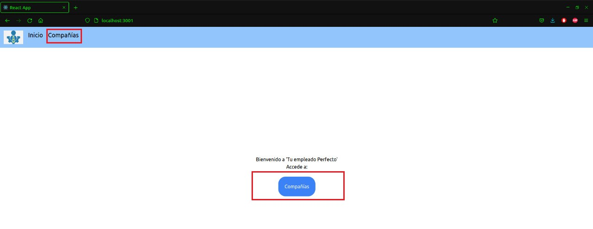
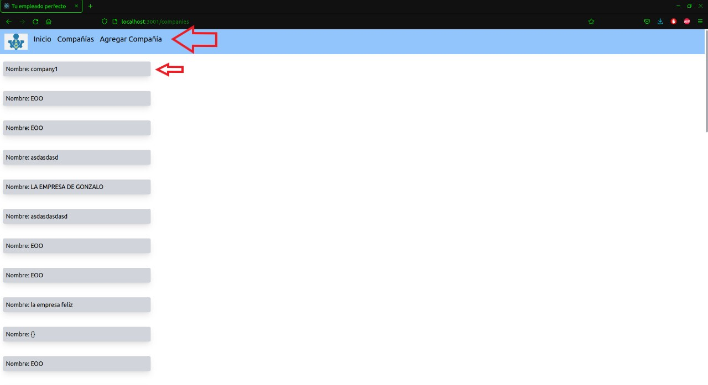

# Getting Started

## Prerequisites
You need to clone the backend repository, and run it, you can do it by clicking the following link: (https://github.com/csagastegui59/tu-empleado-perfecto)

## Installation

1. Run the following commands:

```bash
$ yarn install
```
## Running the app

```bash
# development
$ yarn start
```

Runs the app in the development mode.\
Open [http://localhost:3001](http://localhost:3001) to view it in your browser.

The page will reload when you make changes.\
You may also see any lint errors in the console.

## Stay in touch

- Developer - [Christian Sagástegui](https://github.com/csagastegui59)







